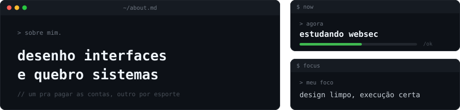

## Building in public

## The point of view

> Learning WebSec

Webdesigner and Gfx Artist.

*Small, useful work over vague claims.*

## What I am shipping

## The stack

## Start a conversation

[GitHub](https://github.com/Artt4sec)

// feito em araçatuba, brasil

